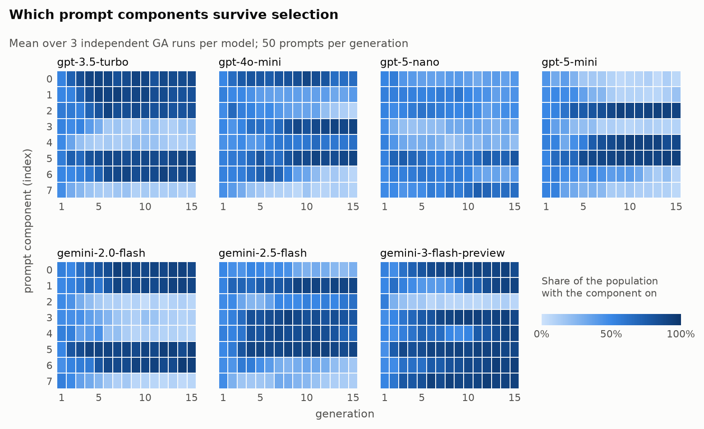
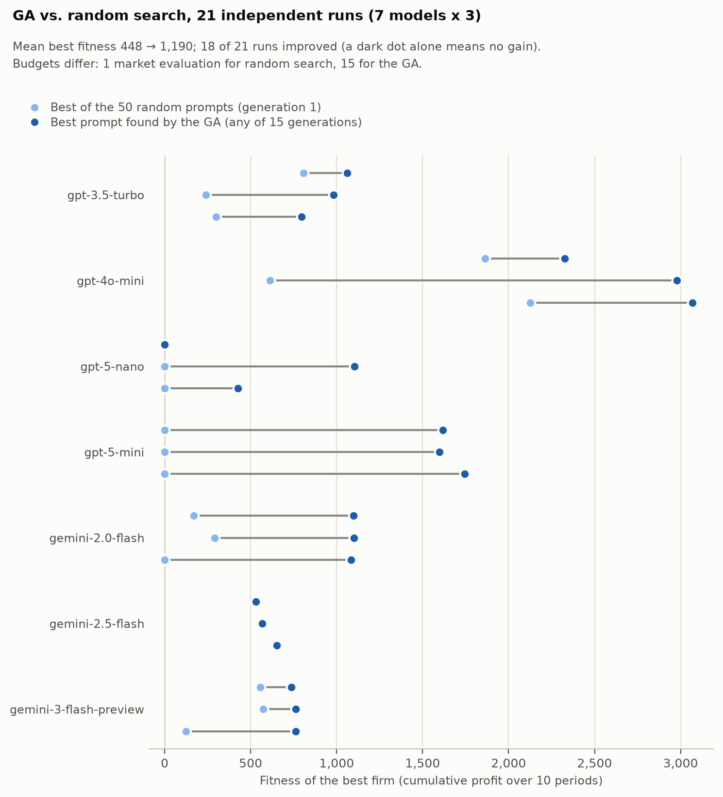
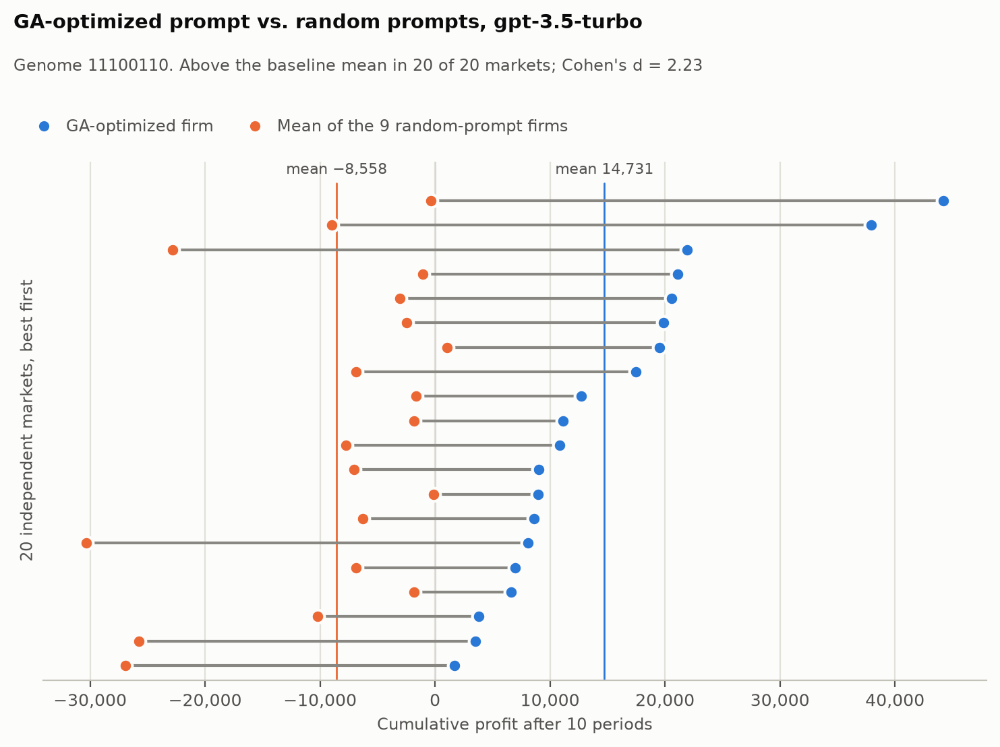

# Evolutionary System-Prompt Optimization for LLM Agents in a Competitive Market

[](https://github.com/OsaIoT/llm-abm-optimization/actions/workflows/ci.yml)


LLM-driven firms compete in an agent-based market. Each firm's system prompt is assembled from 8 modular
components, and a binary genetic algorithm (GA) decides which ones to switch on, using nothing but the profit
the firm earns as fitness: no gradients, no fine-tuning, no access to model internals. The same code runs on
OpenAI and Google Gemini models.

What the experiments show, with 7 LLMs (gpt-3.5-turbo, gpt-4o-mini, gpt-5-nano, gpt-5-mini, gemini-2.0-flash,
gemini-2.5-flash, gemini-3-flash-preview) and 3 independent GA runs each. The numbers come from the committed logs
in [`results/`](results) and [`experiments/`](experiments); `analysis/make_figures.py` rebuilds the figures and
[`results/summary.md`](results/summary.md) from them.

- The GA finds a better prompt than random search in 18 of 21 runs, raising the best fitness from 448 to 1,190 on
  average. The gain depends on the model (none on gemini-2.5-flash), and the two budgets differ, see
  [Limitations](#limitations).
- An optimized gpt-3.5-turbo firm earns +14.7k on average against −8.6k for random-prompt competitors, ahead in
  20 of 20 markets (Cohen's d = 2.2).
- The GA keeps the cost statement and mostly drops the explicit goal. "The cost of production is *k* times the
  quality level" is on in 21 of 21 final best prompts; "maximize profit, never incur a loss" is on in 5 of 21.
- Which components survive depends on the model. 4 of 7 models reach the same best prompt in all 3 runs; the
  other three differ by 2 to 3.3 bits out of 8.

## How it works

Each period of the simulation has four steps:

1. **Decision.** Every active firm chooses a price *p* in [0.1, 1] and a quality *q* in [0, 1]. The unit cost is
   *k·q*, with *k* = 0.75.
2. **Consumer choice.** Each buyer picks one firm at random, with probabilities given by a softmax over the
   quality-to-price ratios (temperature 0.1).
3. **Market update.** A firm's profit is units sold × (*p* − cost).
4. **Bankruptcy rule.** A firm with negative profit in 3 consecutive periods leaves the market.

An **LLM firm** sends its system prompt (the components switched on by its genome, plus a mandatory format line)
and a fixed user instruction to the model, capped at 30 tokens, and parses `DECISION: (price, quality)`. A reply
that cannot be parsed, or is out of range, takes the firm out of the market. **Rule-based firms**, a simple
profit-reactive heuristic, give a non-LLM reference. Providers are wrapped in
[`llm/client.py`](src/llm_abm_ga/llm/client.py); everything else is plain Python and NumPy.

The **GA** ([`ga/`](src/llm_abm_ga/ga)) evolves a population of 50 prompts. The 50 firms play one market together
and fitness is the cumulative profit over 10 periods, so a prompt is judged against the other prompts of its
generation. Selection is by tournament (k = 6) with 5 elites, followed by uniform crossover and bit-flip mutation
(0.1), for 15 generations. The search space is 2^8 = 256 prompts.

| # | Prompt component | On in the 21 final best genomes |
|---|---|---|
| 0 | You are a company operating in a competitive market composed by {n_competitors} other firms and {n_buyers} buyers. | 13 |
| 1 | You have access to historical data on your own performance and market trends. | 12 |
| 2 | Use this information to analyze the market and determine the optimal price and quality level for your product. | 9 |
| 3 | Buyers select products based on the highest quality-to-price ratio, The higher it is, the more likely they are to buy from you. | 10 |
| 4 | Each buyer purchases only one product per period. | 10 |
| 5 | The cost of production is {cost_index} times the quality level. | **21** |
| 6 | The profit of each period is given by the formula: profit = #sold_products * (price - cost). | 11 |
| 7 | Your primary goal is to maximize profit in each period, and never incur a loss. | **5** |

## Results

### The GA converges on a short list of components

<picture>
  <source media="(prefers-color-scheme: dark)" srcset="docs/images/convergence_dark.png">
  
</picture>

Averaged over three runs, the four models whose runs agree show sharp bands within the first half of the run.
gpt-5-nano and gemini-2.5-flash, whose runs disagree, stay mid-blue.

| Model | Best genome of each run (1 = component on) | Same in all runs |
|---|---|---|
| gpt-3.5-turbo | `11100110` `11100110` `11100110` | yes |
| gpt-4o-mini | `01010100` `10011100` `10011100` | no |
| gpt-5-nano | `10010110` `00000101` `10110101` | no |
| gpt-5-mini | `00101100` `00101100` `00101100` | yes |
| gemini-2.0-flash | `11000110` `11000110` `11000110` | yes |
| gemini-2.5-flash | `00011110` `01111100` `01100100` | no |
| gemini-3-flash-preview | `11011111` `11011111` `11011111` | yes |

### Against random search

<picture>
  <source media="(prefers-color-scheme: dark)" srcset="docs/images/ga_vs_random_search_dark.png">
  
</picture>

The paired comparison is significant (one-sided Wilcoxon signed-rank, p < 0.001). Three runs found nothing better
than generation 1: gemini-2.5-flash twice and gpt-5-nano once. For gpt-5-nano and gpt-5-mini none of the 50 random
prompts made a profit, so the starting point was 0.

### Against random-prompt competitors

<picture>
  <source media="(prefers-color-scheme: dark)" srcset="docs/images/optimized_vs_baseline_dark.png">
  
</picture>

Each of the 20 markets has one firm with the evolved gpt-3.5-turbo genome (`11100110`) and nine firms with random
prompts, all played by gpt-3.5-turbo (100,000 buyers, 10 periods). The optimized firm averages 14,731 (SD 11,028);
the random-prompt firms average −8,558 (SD 9,785).

### Survival and cost regimes

Two follow-up experiments use `gpt-4o-mini` ([`experiments/`](experiments)):

- **Bankruptcy.** The optimized firm went bankrupt in 0 of 20 markets, against 52 of 180 random-prompt firms
  (28.9%). The genome was evolved for gpt-3.5-turbo and played by gpt-4o-mini, so this is a transfer setting.
- **Cost index.** The genome evolved at *k* = 0.75 is specialised to that regime:

| k | Optimized: mean profit | Optimized: bankruptcies | Random prompts: mean profit | Random prompts: bankruptcies |
|---|---|---|---|---|
| 0.30 | 8,744 | 0/10 | 28,027 | 2/90 |
| 0.50 | 2,424 | 0/10 | 9,316 | 0/90 |
| 0.75 | 22,092 | 0/10 | 2,305 | 27/90 |
| 0.90 | 0 | 5/10 | −10,477 | 37/90 |

At low cost it survives but earns less than random prompts on average; at *k* = 0.9 it fails in half of the markets.
All tables are in [`results/summary.md`](results/summary.md).

## Limitations

- The random-search baseline is not budget-matched. It is the best of the 50 random prompts of generation 1 (one
  market evaluation), while the GA gets 15. A fair comparison would use the best of 15 independent random
  populations, which has not been run yet.
- The model does not see the market state. `Firm.make_decision` formats the firm's own history and the
  competitors' last offers, but the default user template ([`prompts/components.py`](src/llm_abm_ga/prompts/components.py))
  is a fixed instruction without placeholders, so these experiments evaluate prompts that carry no market
  observations. Components 1 and 2 mention data the model is never given. Passing the state is a template change
  and the obvious next experiment.
- The objective is noisy. Fitness is relative to the other 49 prompts of the generation, and only 4 of 7 models
  converge to the same genome in every run. At temperature 0 a hosted model still returned the same decision in
  94-97% of 100 identical calls, and a GA re-run landed 1 to 4 bits from the original
  ([`experiments/reproducibility`](experiments/reproducibility)).
- With 8 components there are only 256 prompts. A larger library would be the more interesting test.
- The optimized genomes are evolved for one cost index (*k* = 0.75) and one market design; the cost experiment
  above shows how much that matters.
- Three runs per model is enough to see convergence or its absence, not to rank models.

## Reproduce

Rebuild the figures and tables from the committed logs. No API key needed:

```bash
pip install -e ".[analysis]"
python analysis/make_figures.py
```

Run your own simulations (this calls a paid API):

```bash
pip install -e .
cp .env.example .env            # add OPENAI_API_KEY or GEMINI_API_KEY, pick LLM_PROVIDER and LLM_MODEL

python scripts/run_market.py --buyers 1000 --periods 10
python scripts/run_ga.py --generations 3 --pop-size 10 --buyers 2000   # a quick, cheap check
python scripts/run_ga.py                                               # the settings used for the logs
```

A GA generation costs `pop_size × periods` model calls, so the default run is 15 × 50 × 10 = 7,500 calls.
`--seed` fixes the GA and market randomness; model replies stay non-deterministic.

## Repository layout

```
src/llm_abm_ga/   market, agents (LLM and rule-based firms), GA, prompts, provider client
scripts/          run_market.py, run_ga.py
analysis/         make_figures.py: figures and summary tables from results/
results/          GA logs (7 models x 3 runs), optimized-vs-baseline data, summary.md
experiments/      bankruptcy, cost sensitivity, reproducibility
notebooks/        templates to run the GA or a single market interactively (need an API key)
tests/            unit tests and an end-to-end GA run with a stubbed LLM: no key, no network
```

```bash
pip install -e ".[dev]"
pytest
```

## License

MIT, see [LICENSE](LICENSE).
